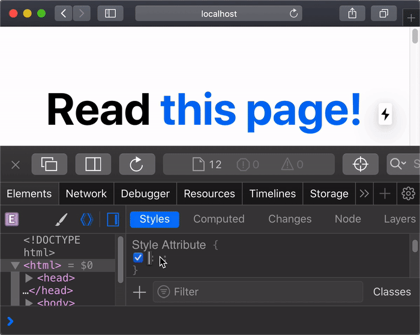

# Next.js advantage

## How Next.js Works

### What is Compiling?

Compiling refers to the process of taking code in one language and outputting it in another language or another version of that language.


### What is Minifying?

Developers write code that is optimized for human readability. This code might contain extra information that is not necessary for the code to run, such as comments, spaces, indents, and multiple lines.


### What is Bunding?

Developers break up their application into modules, components, and functions that can be used to build larger pieces of their application. Exporting and importing these internal modules, as well as external third-party packages, creates a complex web of file dependencies.


### What is Code Splitting?

Developers usually split their applications into multiple pages that can be accessed from different URLs. Each of these pages becomes a unique **entry point** into the application.

Code-splitting is the process of splitting the application's bundle into smaller chunks required by each entry point. The goal is to improve the application's initial load time by only loading the code required to run that page.


### Build Time and Runtime

**Build time** (or build step) is the name given to a series of steps that prepare your application code for production.

When you build your application, Next.js will transform your code into production-optimized files ready to be deployed to servers and consumed by users. These files include:

- HTML files for statically generated pages.
- JavaScript code for rendering pages on the server
- JavaScript code for making pages interactive on the client.
- CSS files

**Runtime** (or request time) refers to the period of time when your application runs in response to a user's request, after your application has been built and deployed.

### Client and Server

In the context of web applications, the **client** refers to the browser on a user's device that sends a request to a server for your application code. It then turns the response it receives from the server into an interface the user can interact with.


**Server** refers to the computer in a data center that stores your application code, receives requests from a client, does some computation, and sends back an appropriate response.

### What is Rendering?

There is an unavoidable unit of work to convert the code you write in React into the HTML representation of your UI. This process is called **rendering**.

Rendering can take place on the server or on the client. It can happen either ahead of time at build time, or on every request at runtime.

With Next.js, three types of rendering methods are available: **Server-Side Rendering, Static Site Generation**, and **Client-Side Rendering**.

**Pre-Rendering**

Server-Side Rendering and Static Site Generation are also referred to as **Pre-Rendering** because the fetching of external data and transformation of React components into HTML happens before the result is sent to the client.

**Client-Side Rendering vs. Pre-Rendering**

In a standard React application, the browser receive an empty HTML shell from the server along with the JavaScript instructions to construct the UI. This is called **client-side rendering** because the initial rendering work happens on the user's device.


In practice, this means that for a fully client-side rendered app, the user will see a blank page while the rendering work is being done. Compared to a pre-rendered app, where the user will see the constructed HTML:


**Server-Side Rendering**

With server-side rendering, the HTML of the page is generated on a server for **each** request. The generated HTML, JSON data, and JavaScript instructions to make the page interactive are then sent to the client.

**Static Site Generation**

With Static Site Generation, the HTML is generated on the server, but unlike server-side rendering, there is no server at runtime. Instead, content is generated once, at build time, when the application is deployed, and the HTML is stored in a CDN and re-used for each request.

**What is the Network**

It's helpful to know where your application code is stored and run once it's deployed to the network. You can think of the network as linked computers (or servers) capable of sharing resources. In the case of a Next.js application, your application code can be distributed to **origin servers, Content Delivery Networks (CDNs)**, and **the Edge**.

**Origin Servers**

As we discussed earlier, the server refers to the main computer that stores and runs the original version of your application code.

We use the term **origin** to distinguish this server from the other places application code can be distributed to, such as **CDN servers** and **Edge servers**.

**Content Delivery Network**

CDNs store static content (such as HTML and image files) in multiple locations around the world and are placed between the client and the origin server. When a new request comes in, the closest CDN location to the user can respond with the cached result.


## CREATE YOUR FIRST APP

### Create a Next.js App

To build a complete web application with React from scratch, there are many important details you need to consider:

- Code has to be bundled using a bundler like webpack and transformed using a compiler like Babel.
- You need to do production optimizations such as code splitting.
- You might want to statically pre-render some pages for performance and SEO. You might also want to use server-side rendering or client-side rendering.
- You might have to write some server-side code to connect your React app to your data store.

Next.js aims to have best-in-class developer experience and many built-in features, such as:

- An intuitive page-based routing system (with support for dynamic routes)
- Pre-rendering, both static generation (SSG) and server-side rendering (SSR) are supported on a per-page basis
- Automatic code splitting for faster page loads
- Client-side routing with optimized prefetching
- Built-in CSS and Sass support, and support for any CSS-in-JS library
- Development environment with Fast Refresh support
- API routes to build API endpoints with Serverless Functions
- Fully extendable

**Setup**

### Navigate Between Pages

**What You'll Learn in This Lesson**

- Create a new page using the integrated file system routing.
- Learn how to use the `Link` component to enable client-side navigation between pages.
- Learn about built-in support for code splitting and prefetching.

**Pages in Next.js**

In Next.js, a page is a React Component exported from a file in the `pages directory`.

Pages are associated with a route based on their **file name**.

- `pages/index.js` is associated with the `/` route.
- `pages/posts/first-post.js` is associated with the `/posts/first-post` route.

**Create a New Page**

Create the `posts` directory under `pages`.

Create a file called `first-post.js` inside the `posts` directory with the following content:

```
export default function FirstPost() {
  return <h1>First Post</h1>;
}
```

**Link Component**

When linking between pages on websites, you use the `<a>` HTML tag.

In Next.js, you can use the `Link` Component `next/link` to link between pages in your application. `<Link>` allows you to do client-side navigation and accepts props that give you better control over the navigation behavior.

**Using `<Link>`**

First, open `pages/index.js`, and import the `Link` component from `next/link` by adding this line at the top:

```
import Link from 'next/link';
```

Then find the `h1` tag that looks like this:

```
<h1 className="title">
  Welcome to <a href="https://nextjs.org">Next.js!</a>
</h1>
```

And change it to:

```
<h1 className="title">
  Read <Link href="/posts/first-post">this page!</Link>
</h1>
```

Next, open `pages/posts/first-post.js` and replace its content with the following:

```
import Link from 'next/link';

export default function FirstPost() {
  return (
  	<>
  	  <h1>First Post</h1>
  	  <h2>
  	  	<Link href="/">Back to home</Link>
  	  </h2>
  	</>
  );
}
```

**Client-Side Navigation**

The `Link` component enables **client-side navigation** between two pages in the same Next.js app.

Client-side navigation means that the page transition happens using JavaScript, which is faster than the default navigation done by the browser.

Here's a simple way you can verify it:

- Use the browser's developer tools to change the `background` CSS property of `<html>` to `yellow`.
- Click on the links to go back and forth between the two pages.
- You'll see that the yellow background persists between page transitions.

This shows that the browser does not load the full page and client-side navigation is working.



If you've used `<a href="..."` instead of `<Link href="...">` and did this, the background color will be cleared on link clicks because the browser does a full refresh.

**Code splitting and prefetching**

Next.js does code splitting automatically, so each page only loads what's necessary for that page. That means when the homepage is rendered, the code for other pages is not served initially.

This ensures that the homepage loads quickly even if you have hundreds of pages.

Only loading the code for the page you request also means that pages become isolated. If a certain page throws an error, the rest of the application would still work.

Furthermore, in a production build of Next.js, whenever `Link` components appear in the browser's viewport, Next.js automatically **prefetches** the code for the linked page in the background. By the time you click the link, the code for the destination page will already be loaded in the background, and the page transition will be near-instant!

### Assets, Metadata, and CSS

**What You'll Learn in This Lesson**

- How to add <span style="color: #0074de;">static files</span> (images, `etc`) to Next.js.
- How to customize what goes inside the `<head>` for each page.
- How to create a reusable React component which is styled using <span style="color: #0074de;">CSS Modules</span>.
- How to <span style="color: #0074de;">add global CSS</span> in <span style="color: #0074de;">`pages/_app.js`</span>.
- Some useful tips for styling in Next.js.

**Assets**

Next.js can serve **static assets**, like images, under **the top-level** <span style="color: #0074de;">`public` directory</span>. Files inside `public` can be referenced from the root of the application similar to <span style="color: #0074de;">`pages`</span>.

The `public` directory is also useful for `robots.txt`, Google Site Verification, and any other static assets. Check out the documentation for <span style="color: #0074de;">Static File Serving</span> to learn more.

**Download Your Profile Picture**

First, let's retrieve your profile picture.

- **Download** your profile picture in `.jpg` format (or <span style="color: #0074de;">use this file</span>).
- Create an `images` directory inside of the `public` directory.
- Save the picture as `profile.jpg` in the `public/images` directory.
- The image size can be around 400px by 400px.
- You may remote the unused SVG logo file directly under the <span style="color: #0074de;">`public` directory</span>.

**Unoptimized Image**

With regular HTML, you would add your profile picture as follows:

```

```

However, this means you have to manually handle:

- Ensuring your image is responsive on different screen sizes
- Optimizing your images with a third-party tool or library
- Only loading images when they enter the viewport

**Image Component and Image Optimization**
