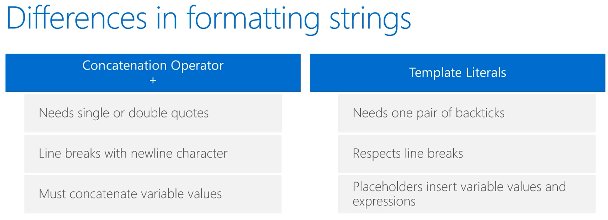
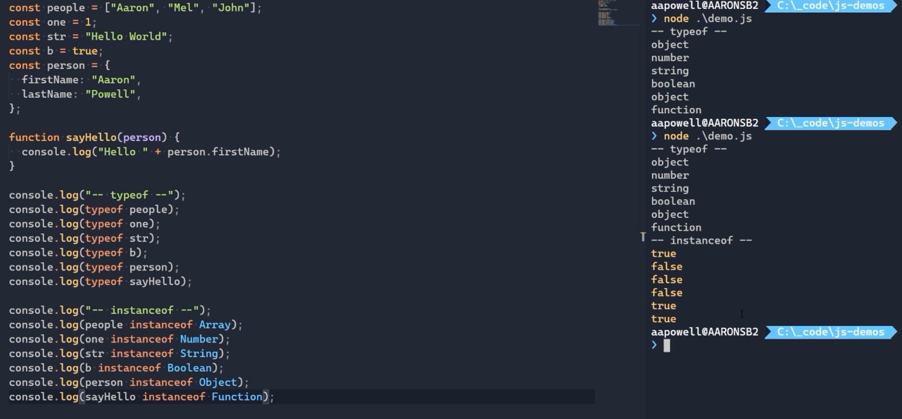
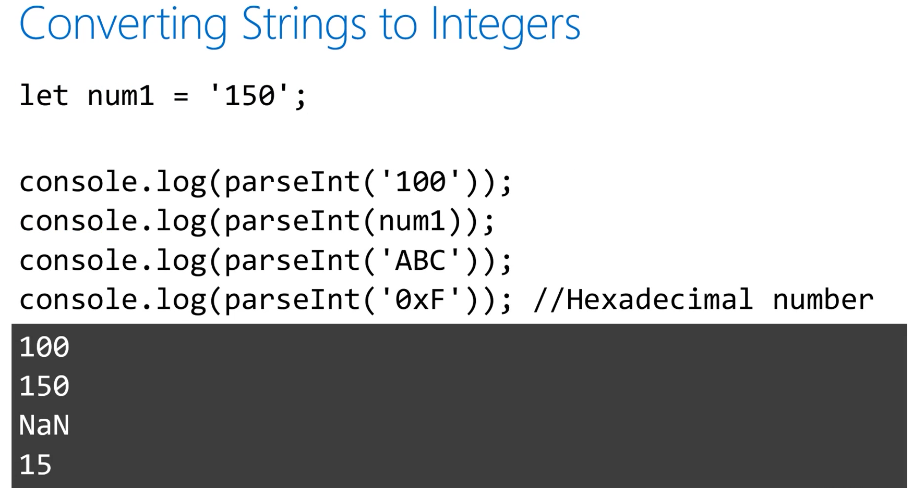
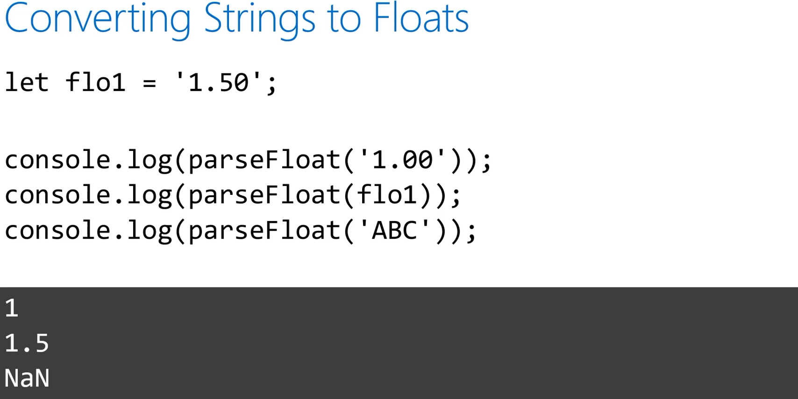
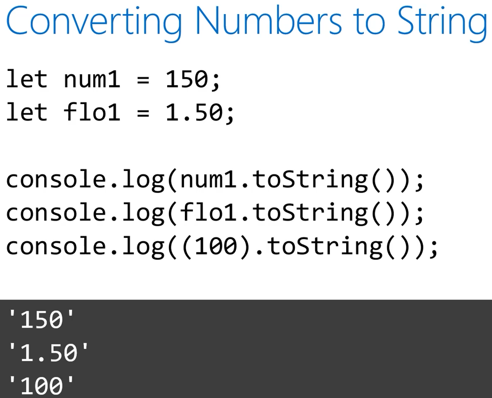
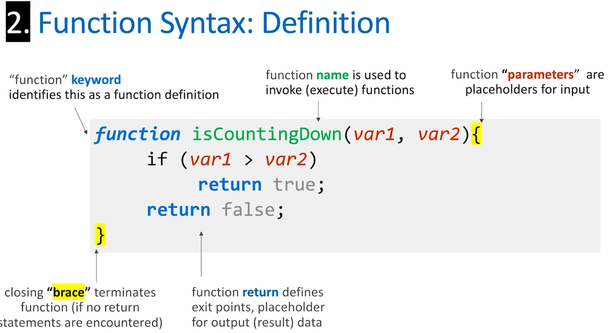
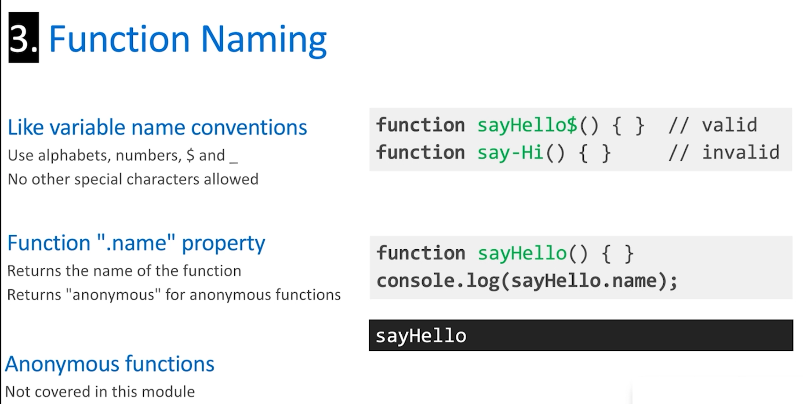
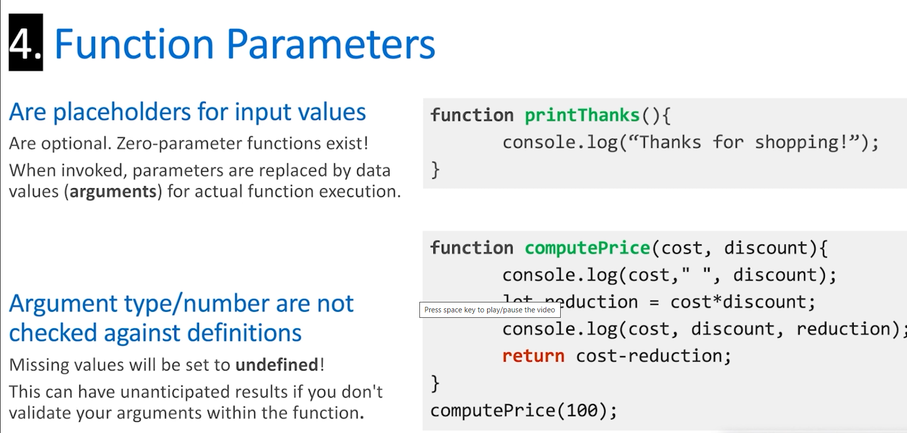
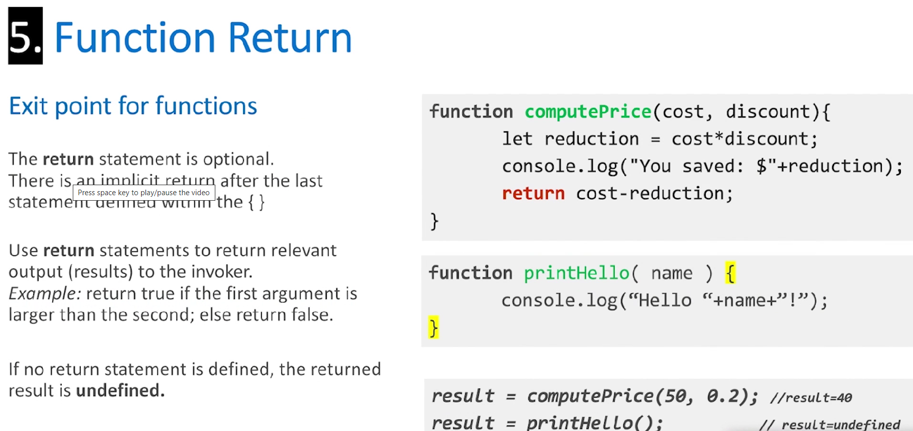
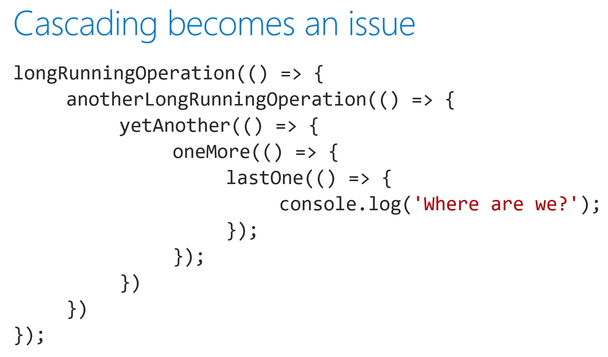

# Learn JavaScript

## VS Code Extensions

For JavaScript Developers

- `ESLint` :
  Find and fix problems in your JavaScript code before it hits production.
- `Prettier` :
  Automatic code formatter, so you don't have to care about that extra space.
- `JavaScript (ES6) code snippets` :
  Avoid redundant typing with shortcuts to most used code fragments.

## Install Node.js using NVM

Manage updates and multiple environments

For macOS, Linux or WSL users

[https://github.com/nvm-sh/nvm](https://github.com/nvm-sh/nvm)

For Windows users

[https://github.com/coreybutler/nvm-windows](https://github.com/coreybutler/nvm-windows)

```
nvm install node
```

## Declaring variables

Three ways:

```
var one = 1;
let two = 2;
const three = 3;
```

## Working with strings

### Template Literals

**Flexible Formatting**

Syntax makes strings easier to format and read

Use placeholders ${} for variables or expressions

Respects line breaks. Doesn't need newline character "\n"

**Use backticks**

Template literals only require the backtick character ``, placed at the beginning and end of a string. No need for quote characters.



## Data types in JavaScript

JavaScript is Weakly Typed

Simple type system

​		Number (float), String, Boolean, Date, Function, Array and Object

Special Types

​		`NaN`, null, undefined

**Checking Type**

<span style="color:red;">typeof</span> operator

​		Returns a string of the data type primitive

<span style="color:red;">instanceof</span> operator

​		Returns a Boolean of if a value matches the data type

**Equality Gotchas**

```
let x = 0 == '';  // true, type coerced
let x = 0 === '';  // false, type respected
```



## Additional Mathematical Operations

```
let num1 = 100;
console.log(num1 % 1500);	//  Remainder
console.log(++num1);	// increment
console.log(--num1);	// Decrement
```

## Converting between numbers and strings

<span style="color:red;font-weight:bold;">parseInt() and parseFloat()</span>

Convert numerical strings to numbers

Adding non-numerical characters can have unintended results

`parseFloat()` is for floating point numbers, numbers with decimal points 

<span style="color:red;font-weight:bold;">toString()</span>

Convert numbers to numerical strings







## Dates

Time is a construct or at the very least, it's a JavaScript object.

### Working with dates and times in JavaScript

<span style="color:red">One central object - Date</span>

<span style="color:red">Contains both date and time</span>

Internally time is stored as number of milliseconds since 1 Jan 1970

### Creating a date object

```
// 	get right now
const now = new Date();

//	set a specific date and time
//	month counting starts with zero!
const randomDate = new Date(2015, 3, 12, 6, 25, 58);

//	set a specific date - time set to midnight
const win95Launch = new Date(1995, 7, 24);

console.log(randomDate);
console.log(win95Launch);
```

### Setting values

```
const now = new Date();

now.setFullYear(2014);	//	sets year
now.setMOnth(3);	//	April (counting starts at zero)
now.setDate(4);		//	sets day

now.setHours(4);	//	24	hour clock
now.setMinutes(24);
now.setSeconds(46);

console.log(now);
```

## Comparing values in JavaScript

### JavaScript supports the common operators

< for smaller number or closer to start of the alphabet

<= for smaller or equal number or closer to start of alphabet

\> for larger number or further from start of alphabet

\>= for larger or equal number or

### Equality and data type conversions

JavaScript automatically converts data types in many instances

Can lead to bugs in code

Two comparison operators available

== checks for equality regardless of data type

`'42' == 42 tests as true!`

=== checks for equal values and data types

`'42' === 42 tests as false`

### Not equal operator

!= checks for non-equality regardless of data type

!== checks for non-equal values and data types

tips	<span style="color:blue;">Best practice- always use !==</span>

<span style="color:red">If statements</span>

```
const status = 200;
if (status === 200) {
  console.log('OK!');
} else if (status === 400) {
  console.log('Error!');
} else {
  console.log('Unknown status');
}
```

## Other Boolean notes

<span style="color:red">Implicit false values</span>

String

​	Empty strings test as false

Objects

​	Null or undefined objects test as false

Numbers

​	0 tests as false

<span style="color:red">Use ! to reverse the result</span>

<span style="color:red">Strings are case sensitive</span>

Convert to upper or lower case

Consider using locale Compare

<span style="color:red">Combining comparisons</span>

And (both sides must be true)

```
(x & y)
(x && y)
```

Or (either side can be true)

```
(X | y)
(x || y)
```

Shortcut operators && and ||

stops evaluation if the answer is already known

```
(x && y) //	y not evaluated if x is false because the answer is false
(X || y) // y not evaluated if x is true because the answer is true
```

<span style="color:red">Switch (case) statements</span>

```
const status = 200;
switch (status) {
  case 200:
    console.log('OK!');
    break;
  case 400:
  case 500:
    console.log('Error');
    break;
  default:
    console.log('Unknown value');
    break;
}
```

## Creating arrays

<span style="color:red">What's an Array?</span>

**List, or collection of values**

Arrays can contain many different values of different data types

**Each value has an index**

An index is a unique numerical value that represents the value in the array

**Array Length**

After an array is created, you can check its length at any time with `arrayName.length`

<span style="color:red">Getting array length</span>

```
let arrayLength = 5;
let arr1 = [];
let arr2 = Array(arrayLength);
console.log(arr1.length);
console.log(arr2.length);
```

### <span style="color:red">Adding Data to an Array</span>

**During array creation**

You can create an array with data in one statement

**After array creation**

You can add data to an array after it's been created

This method requires assigning the value to an index

Indexes that may already have a value will be overwritten

Keeping track of array's length is important if it has a fixed length

**How can I access the data**

Value in an array can be accessed by its index

**Adding Data during creation**

```
let arr1 = ["A", true, 2];
console.log(arr1[0]);
console.log(arr1[1]);
```

**Adding Data after Creation**

```
let arrayLength = 2;
let arr2 = Array(arrayLength);
arr2[0] = "Value at index 0";
console.log(arr2[0]);
console.log(arr2[1]);	// No value present at index

Output:
"Value at index 0"
undefined
```

<span style="color:red">Lengths and Indexes</span>

**Length**

Sum of spaces that have been allocated for values in the array

**Index**

Numerates values or spaces in array, starting at 0

**Length will always be larger than the index**

Because the index starts at 0

Index of the last item in the array will be the length, subtracted by 1

### <span style="color:red">Manipulating Arrays</span>

**Push and Pop - Affects end of array**

`array.push(values)` adds one or more value to end of array and returns its new length `array.pop()` removes value from end of array and returns removed value

**Shift and Unshift - Affects front of array**

`array.shift()` removes values from front of array and returns removed value 

`array.unshift(values)` adds one or more value to front of array and returns its new length

**`Concat`**

Joins two arrays to make a new array

**Push and Pop**

```
let arr1 = ["A", true, 2];
console.log(arr1.push("new value"));
console.log(arr1);
console.log(arr1.pop());  //Remove last value
console.log(arr1);

output:
4
["A", true, 2, "new value"]
"new value"
["A", true, 2]
```

**Shift and Unshift**

```
let arr1 = ["A", true, 2];
console.log(arr1.unshift("new value"));
console.log(arr1);
console.log(arr1.shift());  //Remove first value
console.log(arr1);

output:
4
["new value", "A", true, 2]
"new value"
["A", true, 2]
```

**`Concat`**

```
let arr1 = ["A", true, 2];
let arr2 = ["B", false, 3];
let newArr = arr1.concat(arr2);
let newArr2 = arr2.concat([1,2,3]);
console.log(newArr);
console.log(newArr2);

output:
["A", true, 2, "B", false, 3]
["B", false, 3, 1, 2, 3]
```

## Loops

### <span style="color:red">Loops in JavaScript</span>

**Execute code multiple times**

Hard coded value

Iterate through a list

While something is true

**Common loop types**

```
while
for
for ... of
```

**while loops**

```
const names = ['Justin', 'Sarah', 'Christopher'];

let index = 0;
while (index < names.length) {
  const name = names[index];
  console.log(name);
  index++;
}
```

**for loops**

```
const names = ['Justin', 'Sarah', 'Christopher'];

for (let index = 0; index < names.length; index++) {
  const name = names[index];
  console.log(name);
}
```

**for ... of loops** 

```
const names = ['Justin', 'Sarah', 'Christopher'];

for (let name of names) {
  console.log(name);
}
```

## Functions

Functions: 5 Things To Know!

1. Basics: What are Functions?
2. Syntax: Define & Invoke your functions
3. Naming: Conventions & Tips
4. Parameters: Providing inputs
5. Return: Providing outputs, exit points

**1. What are functions?**

A block of code that executes a routine task using a series of instructions

```
function printThanks() {
	console.log("Thanks for shopping!");
	console.log("Discounts expire Dec 1!");
}
```

Examples:

`printThanks` - prints one fixed message for all 

`computePrice` - returns customized result based on input data provided for computation

```
function computePrice(cost, discount) {
	let reduction = cost * discount;
	console.log("You saved $" + reduction);
	return cost - reduction
}
```

### 2. Function Syntax: Definition









## Arrow and anonymous functions

**=>**

Sometimes called 'fat arrow functiosn'

Changes to the `this` context

Support implicit return values

Must be assigned to a variable, or immediately used

Reduction in characters typed

```
const add = (a, b) => a + b;
console.log(add(1, 2));  // 3

const subtract = (a, b) => {
	return a - b;
};
console.log(subtract(2, 1)); // 1
```

**`this` context**

Inherited from parent scope

Cannot be changed

Maintained when function is passed as a reference

**Implicit Return**

Single line functions return statement result

Use {} to introduce multiple lines

## The "this" keyword (context)

**Functions need access to runtime context.**

(Object) methods may need access to peer property values

(Standalone) functions may use global variables in execution

**"this" maps to relevant context at runtime**

Maps to enclosing object - for object methods

Maps to global object - for standalone functions

May be undefined (strict mode) or changed (e.g., use apply)

**About the global object**

defaults to window object in browser runtime

defaults to global object in Node.js runtime

use "`globalThis`" to reference the global object consistently

```
const book = {
	isAvailable: false,
	checkIn: function() {
		this.isAvailable = true;
		return this;
	}
};
console.log(book.checkIn());
// prints book object
```

```
function checkIn() {
	return this;
}
console.log(checkIn());
// prints global object
```

## Promises for long running operations

**Certain operations can take a while**

File I/O

REST calls

Database operations

Complex computations

Originally managed through callbacks

```
function callback() {
	console.log('Timeout completed');
}

setTimeout(callback, 3000);  // wait 3 seconds
```



### <span style="color:red">Enter promises</span>

**Common development pattern**

Cleaner version of callbacks

**Recent versions of JavaScript have built-in Promise object**

Long running operations typically return a Promise

### <span style="color:red">Promise</span>

```
function promiseTimeout(ms) {
	return new Promise((resolve, reject) => {
		setTimeout(resolve, ms);
	});
}

promiseTimeout(2000)
	.then(() => {
		console.log('done');
		return Promise.resolve(42);
	})
	.then((response) => {
		console.log(response);
	});
	.catch(() => {
		console.log('cool error handling');
	})
```

