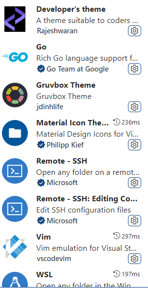

# Windows Notes

## WSL

install `wsl`

```
wsl --install
```

install specify version

```
wsl --install -d Debian
```

uninstall `wsl`

```
wsl --unregister Debian
```

see `wsl` version

```
wsl -l -v
wsl --list
```

install Node in Debian

```
curl -fsSL https://deb.nodesource.com/setup_18.x | bash - &&\
apt-get install -y nodejs
```

install Node in Ubuntu

```
curl -fsSL https://deb.nodesource.com/setup_18.x | sudo -E bash - &&\
sudo apt-get install -y nodejs
```

install global yarn

```
npm install --global yarn
```

install `golang`

```
wget https://golang.google.cn/dl/go1.19.2.linux-amd64.tar.gz
rm -rf /usr/local/go && tar -C /usr/local -xzf go1.19.2.linux-amd64.tar.gz
export PATH=$PATH:/usr/local/go/bin
source .profile
```

install docker

```
curl -sSL https://get.docker.com/ | sh
```

`vscode` 插件

 

